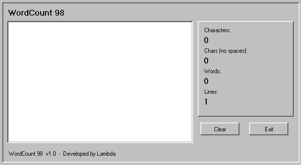

# WordCount 98

A simple character and word counter for everyday use.

## Download

[Download WordCount 98](https://github.com/YOUR-USERNAME/Win98WordCount/releases/latest)

No install needed. Just run `Win98WordCount.exe`.

## Features

- Live word and character counting
- Character count (with and without spaces)
- Word count
- Line count

## Requirements

Windows Vista or later.

## License

See [LICENSE](LICENSE).

## Credits

Developed by Lambda
